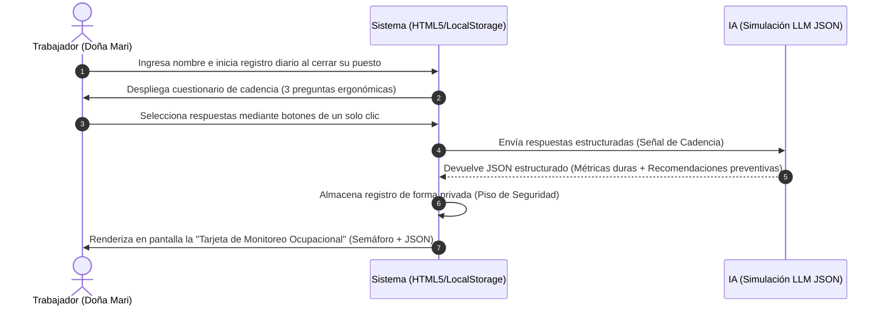

# PACKET: El Escudo de Salud de Doña Mari (Monitoreo Ergonómico y Ocupacional) - Semana 5

## 1. El Problema en Mis Propias Palabras
Los trabajadores independientes del sector informal, como Doña Mari (vendedora de comida en el metro), carecen de sistemas de salud ocupacional y redes de seguridad formal. Al pasar más de 10 horas diarias de pie, expuestos a altas temperaturas y humo de cocinas, acumulan riesgos ergonómicos y cardiovasculares severos. Al no tener un supervisor o área de medicina preventiva, solo atienden sus dolores cuando ya se convirtieron en crisis incapacitantes o crónicas ("cuando el cuidado llega demasiado tarde").

## 2. Definición de Éxito Exacto del Usuario
- **Entrada:** Doña Mari ingresa su nombre y registra al final de su jornada diaria tres datos estructurados mediante botones grandes (horas trabajadas de pie, nivel de pesadez en piernas y nivel de exposición al calor).
- **Procesamiento:** El sistema evalúa estas señales estructuradas de cadencia diaria y las procesa mediante un esquema lógico equivalente a un LLM.
- **Salida:** El sistema guarda el registro de forma privada, renderiza en pantalla una "Tarjeta de Riesgo" visual en formato semáforo y devuelve un objeto JSON estructurado con métricas duras y tres recomendaciones preventivas personalizadas de autocuidado para el día siguiente.
- **Éxito:** Antes de que el módulo de la jornada se cierre, Doña Mari puede comprender de un vistazo su nivel de riesgo ergonómico y leer sus tres acciones obligatorias de prevención sin enfrentarse a un chatbot médico tradicional.

## 3. Flujo del Proceso (Diagrama de Mermaid)

## 4. Línea de Referencia (Benchmark)
- **La mejor solución existente en la Tierra para esto es:** Las aplicaciones corporativas de salud ocupacional como Wellics o los sistemas de monitoreo de riesgos ergonómicos para empleados de oficina.
- **La mía difiere o se localiza por:** Estar diseñada específicamente para trabajadores informales de la calle que no tienen tecnología de escritorio, simplificando la entrada a un cuestionario de 3 clics y traduciendo la analítica compleja en un semáforo de riesgo visual apto para baja alfabetización digital.

## 5. Light Charter (Párrafo a Largo Plazo)
En tres años, "El Escudo de Salud" se consolidará como una plataforma de protección mutua y medicina comunitaria para el sector informal. Al acumular el historial de datos estructurados diarios, los trabajadores podrán descargar reportes validados para acceder a microseguros de salud accesibles. El sistema mutará de alertas pasivas a un motor predictivo que avise al trabajador qué días de la semana representan un peligro de salud según las condiciones climáticas y de mercado.

## 6. Corte de Telescopio (Lo que NO estamos construyendo)
- **ZONA PROHIBIDA:** NO estamos construyendo un chatbot de diagnóstico de síntomas médicos (no adivinamos si tiene varices o hipertensión).
- NO estamos conectando dispositivos médicos o wearables en tiempo real (reloj inteligente, sensores de presión).
- NO estamos generando recetas médicas, prescripción de fármacos ni sustituyendo una consulta con un doctor real.

## 7. Arquitectura y Tabla de Stack

| Capa | Tecnología | Rol en el Proyecto |
| :--- | :--- | :--- |
| **Frontend** | HTML5 / TailwindCSS | Interfaz móvil simplificada y limpia para Doña Mari |
| **Lógica / Core**| JavaScript (ES6) | Captura de la señal estructurada y cálculo de métricas |
| **Capa de Datos**| LLM Mock Output (JSON) | Estructuración estricta de riesgos y consejos de autocuidado |
| **Despliegue** | Vercel | Alojamiento en la nube de producción (100% en vivo) |

## 8. Plan de Pruebas (Test Plan)
- **Caso de Prueba 1 (Riesgo Bajo):** Seleccionar "Menos de 6h", "Leve" y "No". El sistema debe arrojar semáforo verde, score bajo y consejos de mantenimiento estándar.
- **Caso de Prueba 2 (Riesgo Crítico):** Seleccionar "Más de 10h" o "Intenso". El sistema debe arrojar semáforo rojo, activar indicador de riesgo ergonómico arriba de 90/100 y dictar descansos obligatorios de 5 minutos cada 2 horas para el día siguiente.
- **Validación del Contenedor:** Inspeccionar la consola del navegador para confirmar que la salida del núcleo tecnológico imprime un JSON estructurado válido sin campos vacíos.

***
*Nota de descargo: Este sistema es una herramienta educativa de monitoreo ergonómico preventivo para la salud ocupacional y no constituye un consejo médico formal, diagnóstico o tratamiento.*
***
